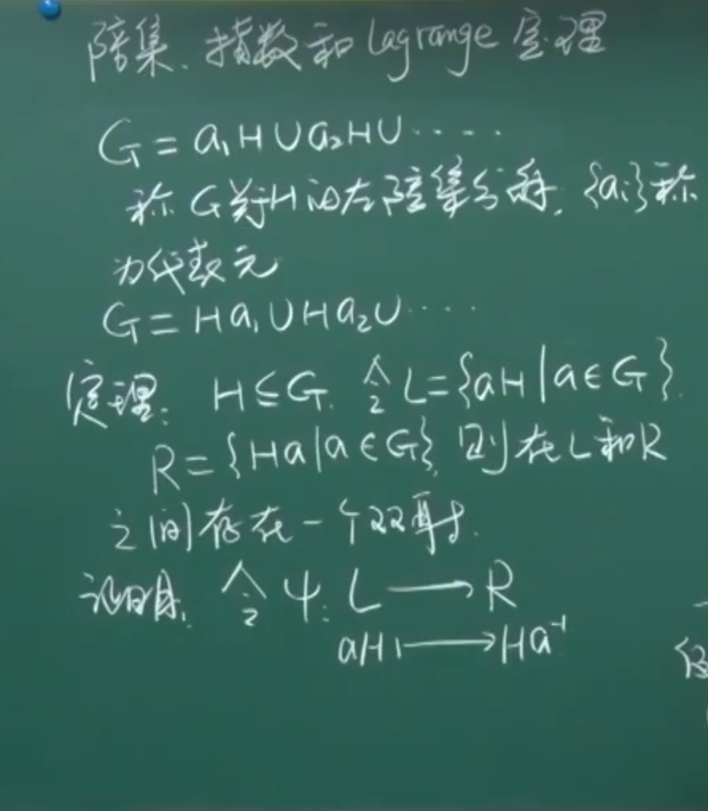
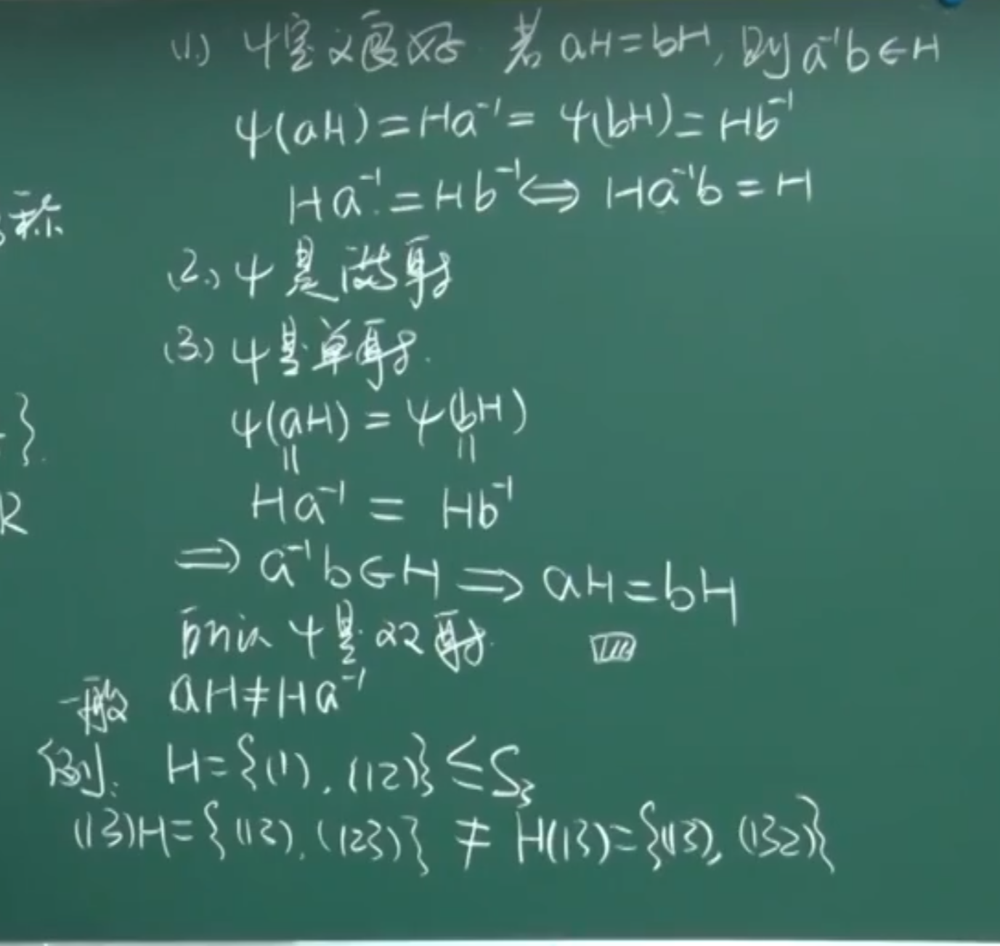
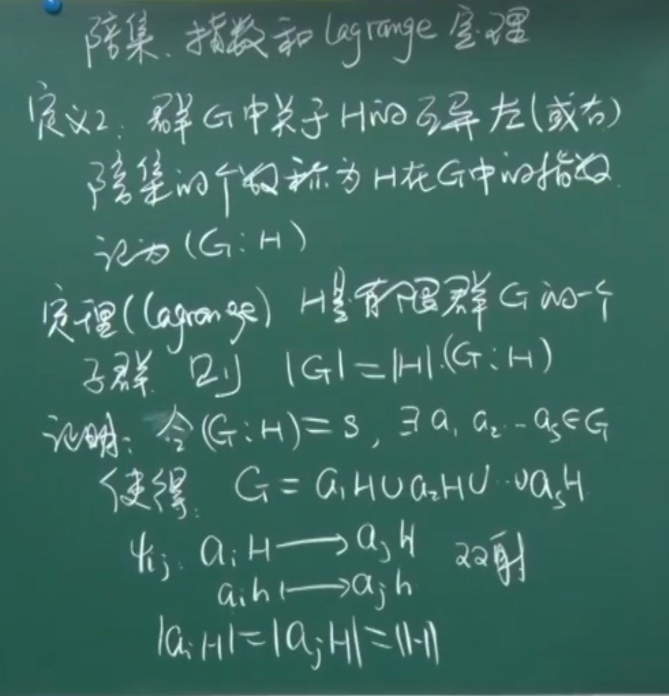
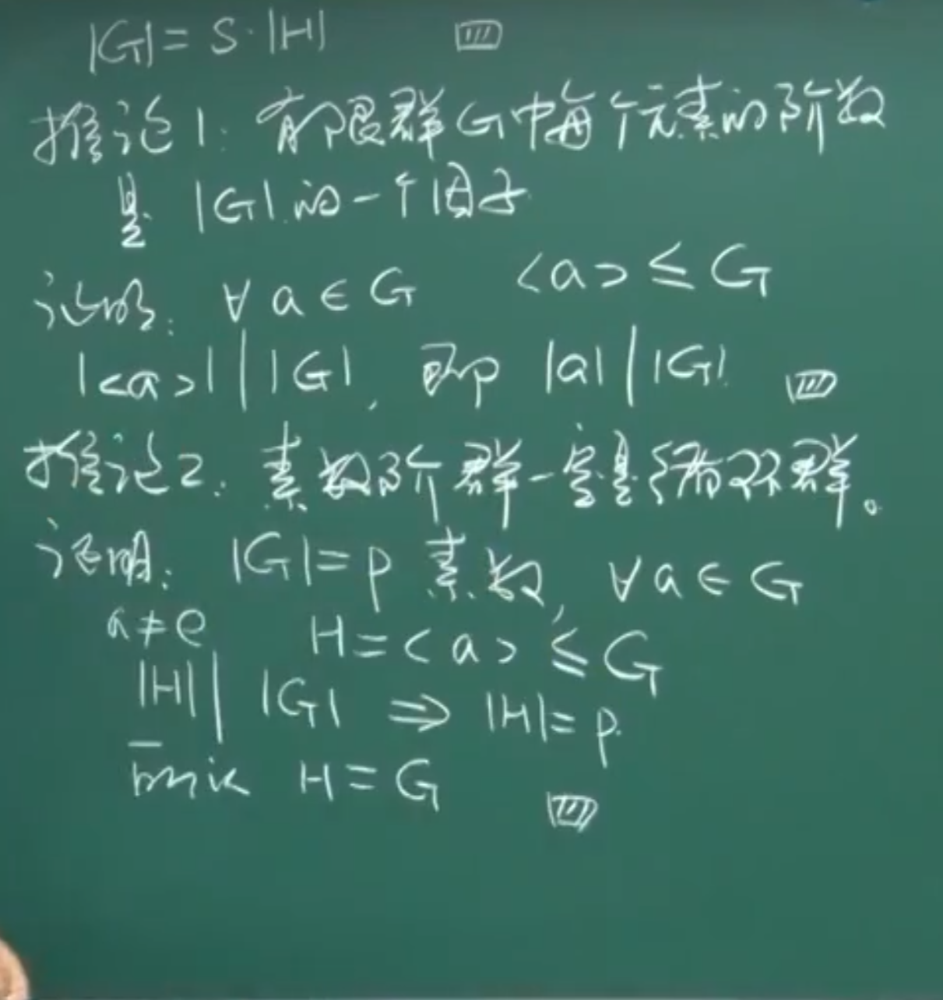
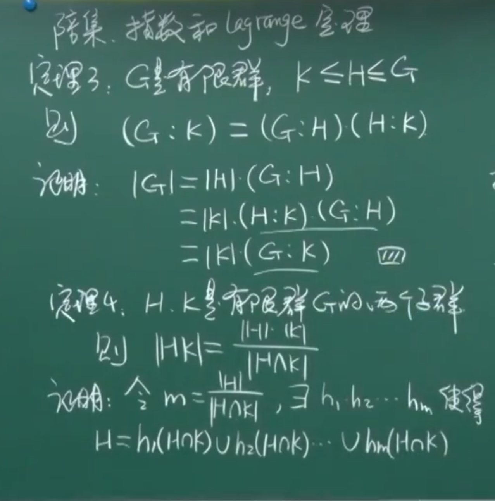
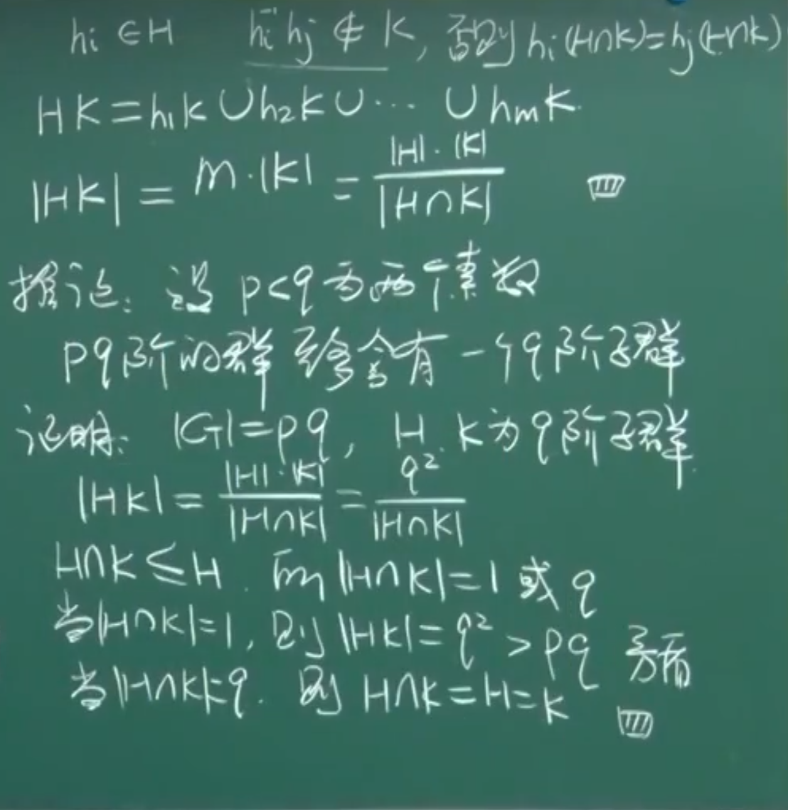

引自：[【哈尔滨工程大学】樊赵兵、马海涛《近世代数基础》](https://www.bilibili.com/video/BV1nR4y1A7jG?p=1&vd_source=9675347ee0ea3a8194ea65aaa3b84568)

# 1.1 基本概念

**定义1**. $M$是一个集合。映射 $f:M \times M \rightarrow M$，称为一个代数运算， $f(a,b)=a \circ b$ ，代数运算简记为 $\circ$ 。

**定义2**. $M$是一个代数系统。有代数运算 $\circ,\oplus$ 。

(i) $\forall a,b,c$， $(a \circ b) \circ c = a \circ (b \circ c)$ 结合律

(ii) $\forall a,b \in M$， $a \circ b = b \circ a$ 交换律

(iii) $\forall a,b,c \in M$， $a \circ (b \oplus c) = (a \circ b) \oplus (a \circ c)$ 对$\oplus$具有左分配律

**定义3**. $M$和 $\overline{M}$ 各有代数运算 $\circ$和$\overline{\circ}$ ，若 $\varphi:M \rightarrow \overline{M}$ 满足 $\forall a,b \in M$，$\varphi(a \circ b) = \varphi(a) \overline{\circ} \varphi(b)$ ，称 $\varphi$是从$M$到$\overline{M}$ 的一个同态映射。

$\varphi$是满射， $M \sim \overline{M}$

$\varphi$是双射， $M \cong \overline{M}$ ，称$M$和 $\overline{M}$ 同构

**定理1**. 若$M \sim \overline{M}$，则

（1）$\circ$满足结合律 $\Rightarrow$ $\overline{\circ}$满足结合律

（2）$\circ$满足交换律 $\Rightarrow$ $\overline{\circ}$满足交换律

**定义4**. $M$是一个集合，$R \subseteq M \times M$称为$M$上的一个二元关系。

**定义5**. 若$R \subseteq M \times M$满足：

(i) 自反性。$(x,x) \in R,\forall x \in M$

(ii) 对称性。$(x,y) \in R \Rightarrow (y,x) \in R$

(iii) 传递性。$(x,y) \in R,(y,z) \in R \Rightarrow (x,z) \in R$

$R$称为$M$上的一个等价关系。

**定义**. $M = {\cup}_{i \in I} M_i$，$M_i$互不相交，称为集合$M$的一个分块。

**定理2**. (1)集合的一个分块决定了一个等价关系。
(2)集合上的一个等价关系决定了集合的一个分块。

# 2.1.1 群的定义

**定义**. 若非空集合$G$有代数运算$\circ$满足：

(1) 结合律，即$\forall a,b,c \in G, (a \circ b) \circ c = a \circ (b \circ c)$

(2) 左单位元，即$\exists e \in G, \forall a \in G, e \circ a = a$

(3) 左逆元，即$\forall a \in G, \exists a^{-1} \in G, a^{-1} \circ a = e$

称$G$对运算$\circ$作成一个群。

注：$a \circ b = b \circ a, \forall a , b \in G$，称G为交换群（Abel群）。

# 2.1.2 群的初步性质

**定理1**. 群的左单位元也是右单位元，并且是唯一的。

**定理2**. 群$G$中元素$a$的左逆元也是右逆元，并且是唯一的。

**推论**. 群中消去律成立。即

$ab = ac \Rightarrow b = c$（左消去律）

$ba = ca \Rightarrow b = c$（右消去律）

**定义**. 若非空集合$S$有一个代数运算满足结合律，称$S$为半群。

若$S$含有单位元，称$S$为幺半群（monoid）。

注：群一定是幺半群，但反之不成立。

**定理3**. $G$是一个半群，$G$成群的充要条件是$\forall a, b \in G, ax = b, ya = b$在$G$中有解。

**推论**. <u>有限</u>半群$G$成群的充要条件是$G$中的消去律成立。

# 2.2 群中元素的阶

**定义1**. $a$是群$G$中的一个元素，使得$a^n = e$的最小正整数$n$称为$a$的阶，记为$|a|$。若这样的$n$不存在，称$a$的阶位无穷，即$|a| = \infty$。

**定理1**. 有限群$G$中元素的阶是有限的。

注：定理1的逆命题不成立。

**定理2**. 若$|a| = n$，则$a^m = e \Leftrightarrow n | m$。

**定理3**. 若$|a| = n$，则$|a^k| = \frac{n}{(k,n)}$，其中$(k,n)$是$k$和$n$的最大公因数。

**推论1**. 若$|a| = st$，则$|a^s| = t$。

**推论2**. 若$|a| = n$，则$|a^k| = n$。当且仅当$(k,n) = 1$

**定理4**. 若$|a| = n,|b| = m,ab=ba,(n,m)=1$，则$|ab|=nm$。

注：1、若$|a| = n,|b| = m,ab=ba$，则$ab=lcm(n,m)$（n和m的最小公倍数）。

2、若$ab \neq ba$，则定理不成立。

# 2.3.1 子群（一）

**定义**. 设$G$是一个群，若$H$关于$G$中运算也成群，称$H$为$G$的一个子群。记为$H \leqslant G$。

注：平凡子群：$H = G, H = \{e\}$

**定理1**. 设$H \leqslant G$，则

（1）$H$的单位元也是$G$的单位元。

（2）$\forall a \in H$，$a$在$H$中的逆元和在$G$中的逆元相同。

**定理2**. $G$的非空子集$H$成子群的充要条件是

（1）$\forall a,b \in H \Rightarrow ab \in H$

（2）$\forall a \in H \Rightarrow a^{-1} \in H$

**定理3**. $G$的非空子集$H$成子群的充要条件是$\forall a,b \in H \Rightarrow ab^{-1} \in H$

**定理4**. $G$的非空有限子集$H$成子群的充要条件是$\forall a,b \in H \Rightarrow ab \in H$

# 2.3.2 子群（二）

**定义**. $C(G)=\{a \in G | az = za, \forall z \in G\}$，称为$G$的中心

**定理5**. $C(G) \leqslant G$

**定义**. 设$A$、$B$是群$G$的两个非空子集，令$AB=\{ab|a \in A, b \in B\}$称为$A$$B$乘积，$A^{-1}=\{a^{-1}|a \in A\}$称为$A$的逆。

注：$(AB)C=A(BC)$

$A(B \cup C) = AB \cup AC$

$(AB)^{-1} = B^{-1}A^{-1}$

$(A^{-1})^{-1} = A$

**推论1**. $H$是群$G$的非空子集，则$H \leqslant G \Leftrightarrow HH=H,H^{-1}=H$。

**推论2**. $H$是群$G$的非空子集，则$H \leqslant G \Leftrightarrow H{H}^{-1}=H$。

**定理6**. $H,K$是$G$的两个子群，则$HK \leqslant G \Leftrightarrow HK=KH$。

# 2.4.1 循环群（一）

$M \leqslant G$，记$<M>$为包含$M$的所有子群的交。

**定义1**. $<M>$称为$G$中由子集$M$生成的子群。

**定义2**. 若$G=<a>$，称$G$为一个循环群。$a$称为$G$的一个生成元。

**定理1**. 若$G=<a>$，

(1) 若$|a|= \infty$，则$<a>=\{ \cdots,a^{-2},a^{-1},e,a^1,a^2,\cdots \}$是无限循环群，且与$Z$同构。

(2) 若$|a|=n$，则$<a>=\{1,a,\cdots,a^{n-1}\}$是$n$阶循环群，且与$u_n$同构。（$u_n$为$n$次单位根群）

**推论1**. $n$阶群$G$为循环群 $\Leftrightarrow$ $G$中有$n$阶元素。

# 2.4.2 循环群（二）

**定理2**. (1) 无限循环群有两个生成元。

(2) $n$阶循环群有$\varphi (n)$个生成元。其中$\varphi (n)$为Enler函数。即$\varphi (n) = \# \{ 0 < k < n | (k,n)=1 \}$，k与$n$互素的元素个数，$a^k$为其生成元

**定理3**. 循环群的子群为循环群。

**定理4**. (1) 无限循环群有无穷个子群。

(2) $G=<a>$为$n$阶循环群，$\forall k | n$，$G$有且仅有一个$k$阶循环群$<a^{\frac{n}{k}}>$。

**推论2**. $n$阶循环群有$T(n)$个子群。$T(n)=(r_1+1)(r_2+1)\cdots(r_s+1)$，$n=p^{r_1}_1p^{r_2}_2 \cdots p^{r_s}_s$，素数分解。

# 2.5 变换群

**定义1**. $M$是一个非空集合，由$M$上的变换关于变换的乘法构成的群称为变换群。

双射变换群：由双射变换构成。

非双射变换群：由一些非双射变换构成。

**定理1**. $M \neq \emptyset$，$S(M)$为$M$上所有双射构成集合，则$S(M)$关于变换的乘法构成群。

**定义2**. $S(M)$称为$M$上的对称群，若$|M|=n$，记$S(M)$为$S_n$，称为$n$元对称群。$|S_n|=n!$

**定理2**. 设$G$是$M$的一个变换群，则$G$是双射变换群 $\Leftrightarrow$ $G$含有$M$上的单（或满）变换。 

**推论1**. $G$是$M$的一个变换群，则$G$是双射变换群 $\Leftrightarrow$ $G$含有恒等映射。

**定理3**. (Cayley) 任意群$G$与一个双射变换群同构。

**推论2**. 任意$n$阶有限群都与$S_n$的一个子群同构。

# 2.6.1 置换群（一）

**定义1**. $S_n$的任意一个子群称为$n$元置换群，简称置换群。

**定义2**. $\sigma \in S_n$，若$\exists \{ a_j,j=1 \cdots k \}$，使得

$$
\sigma (x) =
\begin{cases}  
a_{j+1} & x=a_j,j=1 \cdots k\\ 
a_1 & x=a_k\\
x & x \neq a_j, \forall j
\end{cases}
$$
$\sigma$称为$k$-轮换，记为$\sigma = (a_1 a_2 \cdots a_k)$。2轮换称为对换。

**定理1**. 两个不相连轮换的乘积可交换。

**定理2**. （1）每个置换可表示成不相连轮换的乘积。

（2）每个轮换可表示成对换的乘积。

注：置换写成对换的乘积表示不唯一。

# 2.6.2 置换群（二）

**定理3**. 每个置换写成对换的乘积，对换个数的奇偶性不变。

**定义3**. 若置换写成奇数个对换的乘积，则称为奇置换，否则称为偶置换。

**定理4**. $A_n \leqslant S_n$，且$|A_n| = \frac{n!}{2}$

**定义4**. $\varphi : A_n \longrightarrow M$，
$\sigma \longmapsto \sigma(12)$，

$\varphi$是单射，$\sigma(12) = \tau(12) \Rightarrow \sigma = \tau$

$\varphi$是满射，因此$|A_n|= |M| = \frac{S_n}{2} = \frac{n!}{2}$

$A_n$称为$n$元交错群。

**定理5**. （1）$k$-轮换的阶数为$k$。

（2）不相连轮换乘积的阶数为各因子的最小公倍数。

**定理6**. $\tau = 
\begin{pmatrix}
1 & 2 & \cdots & n  \\
a_1 & a_2 & \cdots & a_n
\end{pmatrix}$，$\forall \sigma$，

$$
\sigma \tau \sigma^{-1} = 
\begin{pmatrix}
\sigma(1) & \sigma(2) & \cdots & \sigma(n)  \\
\sigma(a_1) & \sigma(a_2) & \cdots & \sigma(a_n)
\end{pmatrix}
$$

# 2.7.1 陪集、指数、Lagrange定理（一）

**定义1**. $H \leqslant G, \forall a \in G$，

$aH = \{ ah|h \in H \}$称$G$关于$H$的一个左陪集，

$Ha = \{ ha|h \in H \}$称$G$关于$H$的一个右陪集。

注：一般情形，$aH \neq Ha$。

性质：（1）$a \in aH$

（2）$aH=H \Leftrightarrow a \in H$

（3）$b \in aH \Leftrightarrow aH = bH \Leftrightarrow a^{-1}b \in H$ 或 $b^{-1}a \in H$

（4）$aH \cap bH \neq \emptyset$，则$aH=bH$。

$G = $

# 2.7.1 陪集、指数、Lagrange定理（二）

