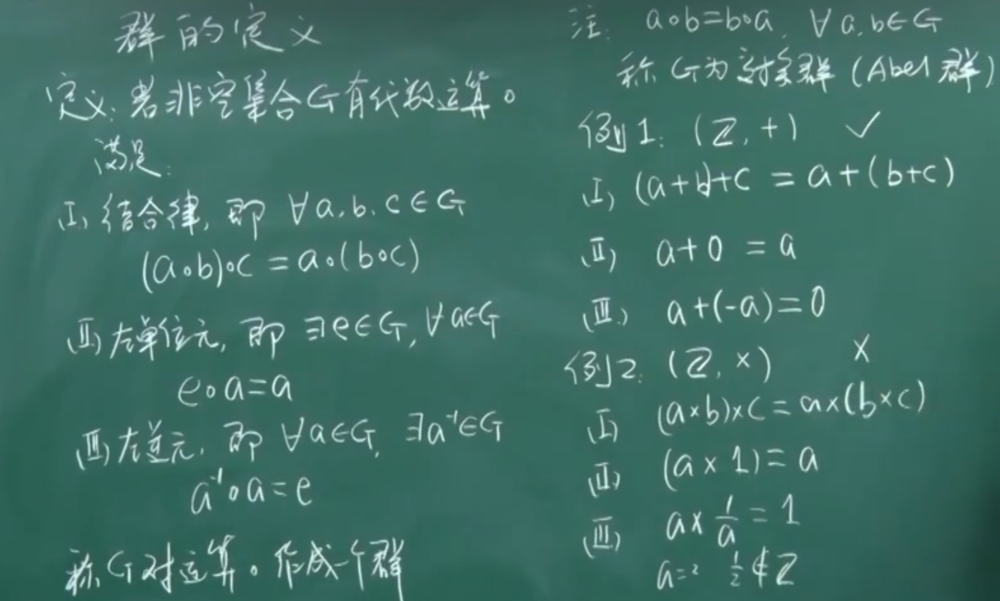
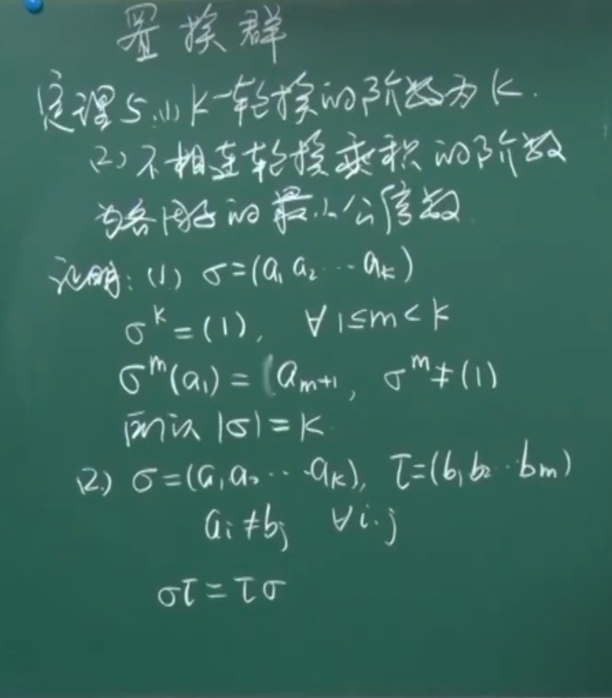
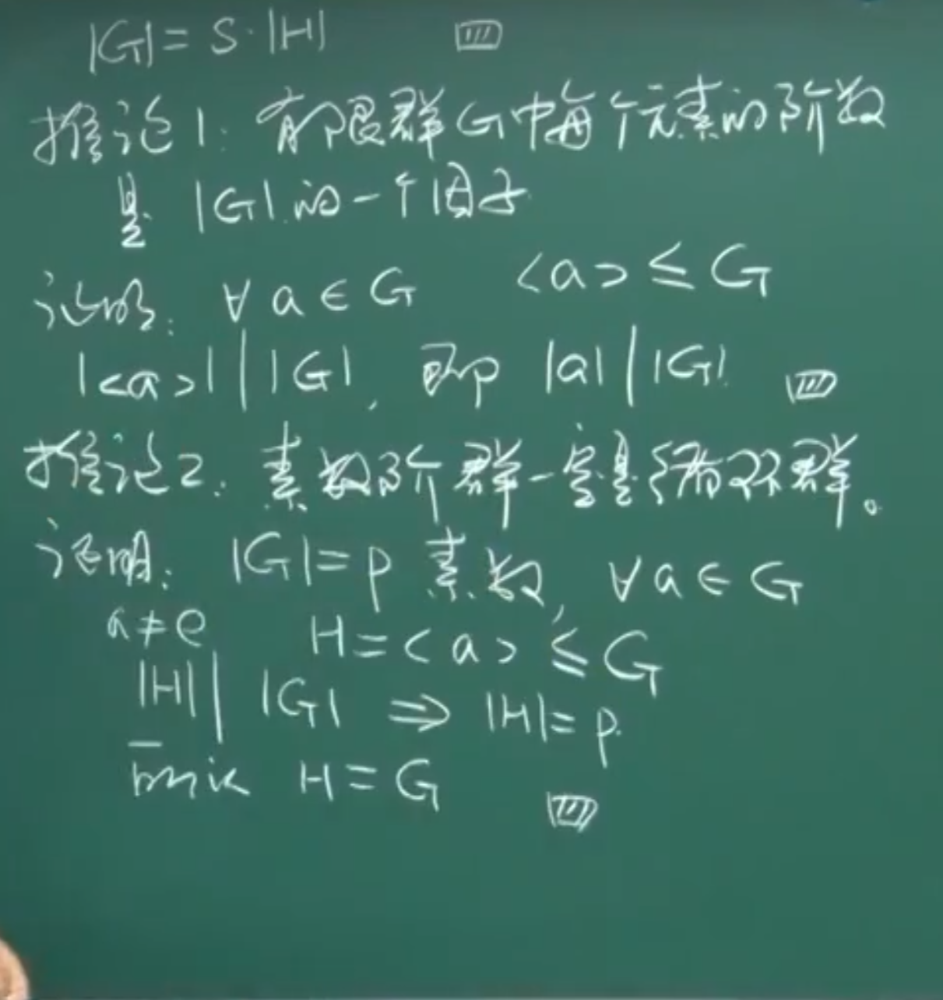
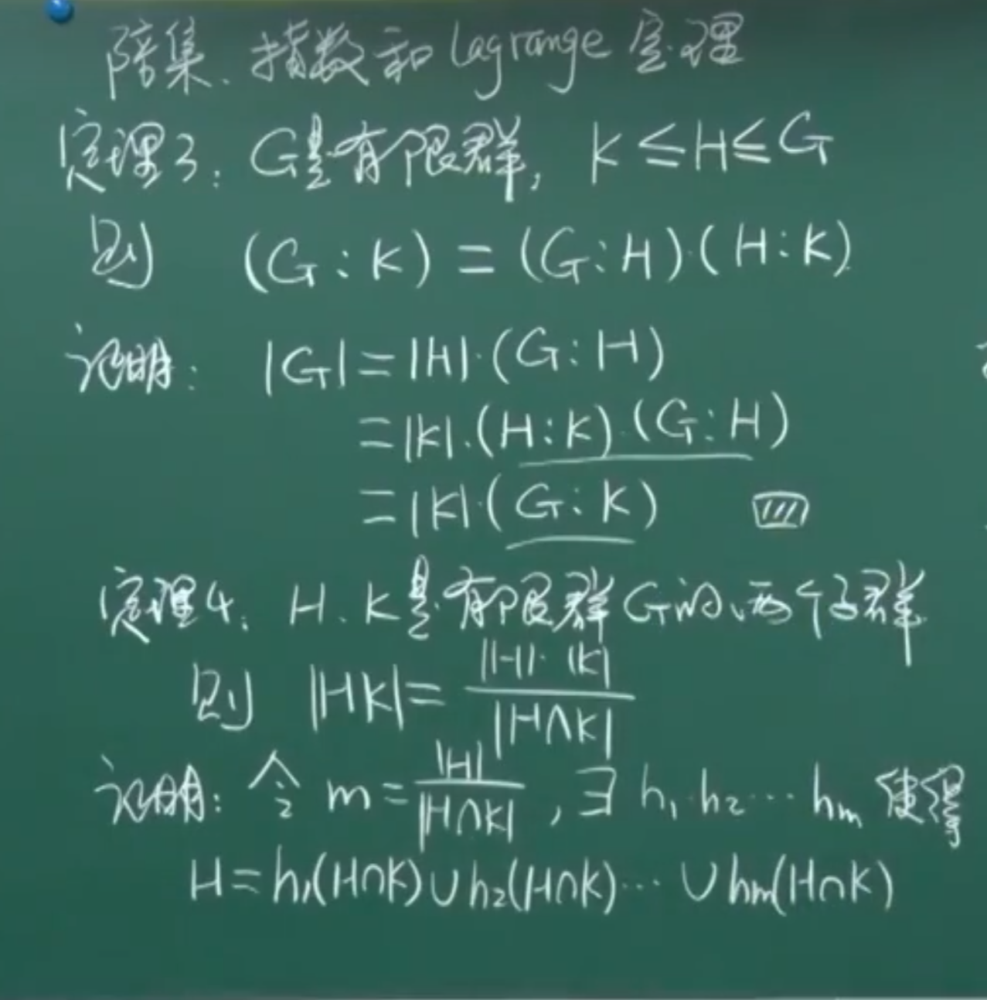
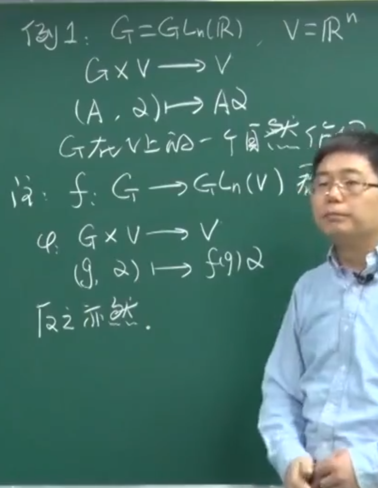
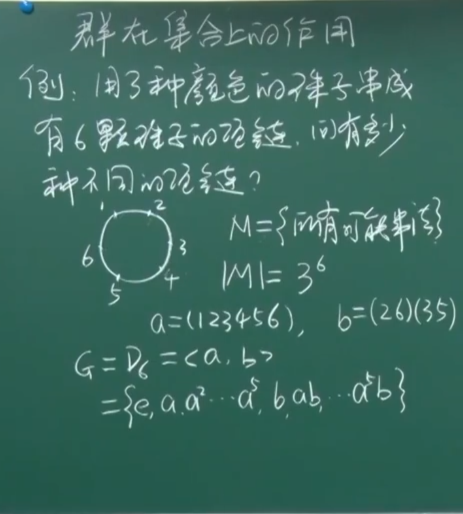

# 1.1 基本概念

# 2.1.1 群的定义

# 2.1.2 群的初步性质

# 2.2 群中元素的阶

# 2.3.1 子群（一）

# 2.3.2 子群（二）

# 2.4.1 循环群（一）

# 2.4.2 循环群（二）

# 2.5 变换群

# 2.6.1 置换群（一）

# 2.6.2 置换群（二）

# 2.7.1 陪集、指数、Lagrange定理（一）

# 2.7.1 陪集、指数、Lagrange定理（二）

# 2.8.1 群在集合上的作用（一）

# 2.8.2 群在集合上的作用（二）

# 3.1 群同态与同构的简单性质

